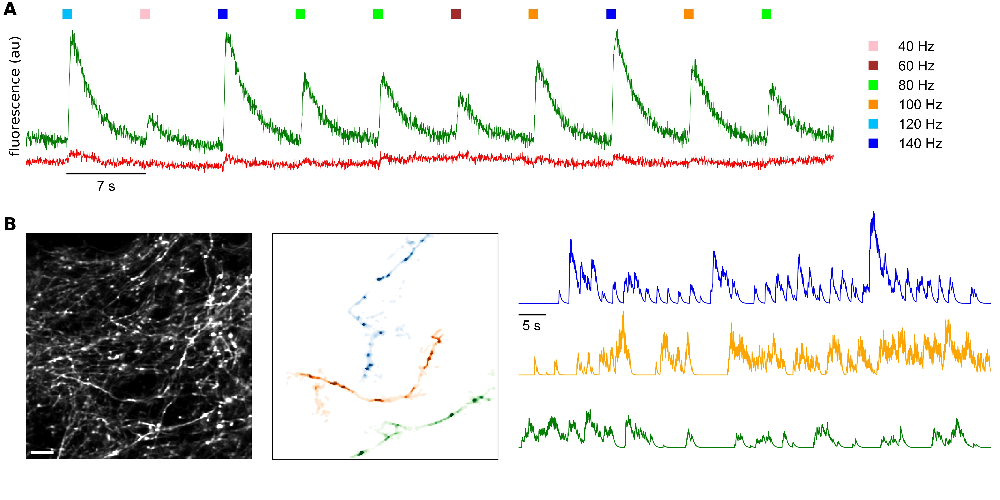

# Spike transmission failures in axons from mouse cortical pyramidal neurons in vivo - 2024

## Netanel Ofer, Victor Hugo Cornejo, Rafael Yuste

### Columbia University

_BioRxiv_ version is available at: https://www.biorxiv.org/content/10.1101/2024.01.29.577733v1

Raw data can be downloaded from: https://academiccommons.columbia.edu/doi/10.7916/y615-0e51

Updated March 19, 2024 by [Netanel Ofer](https://github.com/netanelofer)
